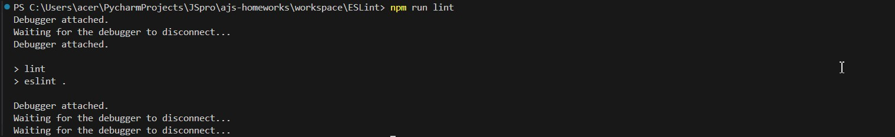

# Домашнее задание к лекции «Рабочее окружение»

---

## ESLint (задача со звёздочкой)

**Важно**: данная задача не является обязательной 

### Легенда

Очень важно следить за качеством кода в вашем проекте и следовать единым принципам кодирования в команде. В этом нам поможет ещё один инструмент - ESLint.

### Описание

Ваша задача «прикрутить» ESLint к проекту и настроить работу с его использованием.

Установка:
```shell
npm install --save-dev eslint
npx eslint --init
```


При инициализации конфиг-файла выберите те же опции, что указаны в лекции:
* How would you like to use ESLint? · *problems*
* What type of modules does your project use? · *esm*
* Which framework does your project use? · *none*
* Does your project use TypeScript? · *No*
* Where does your code run? · *browser, node*
* What format do you want your config file to be in? · *JavaScript*


Настройте скрипт запуска `lint` для `npm`. Для этого в секции `scripts` файла `package.json` пропишите:
```json
{
    ...
    "scripts": {
        ...
        "lint": "eslint ."
        ...
    }
}
```

Создайте файл `src/app.js` со следующим содержимым:
```javascript
const characters = [
  {name: 'мечник', health: 10},
  {name: 'маг', health: 100},
  {name: 'маг', health: 0},
  {name: 'лучник', health: 0}
];

const alive = characters.filter(item => item.health > 0);
```

Содержимое `.eslintignore`:
```
dist
```

Т.к при использования файла `.eslintignore` возникает ошибка с описание, что данный тип файла на сегодняшний день не поддерживается, то для игнорирования содержимого папки dist был использован фаил `eslint.config.mjs`.


Содержимое `.eslintrc.js`:
```js
module.exports = {
  'env': {
    'browser': true,
    'es2021': true,
    'node': true
  },
  'extends': 'eslint:recommended',
  'overrides': [],
  'parserOptions': {
    'ecmaVersion': 'latest',
    'sourceType': 'module'
  },
  'rules': {}
}
```

Запустите ESLint и удостоверьтесь, что вам показываются ошибки стиля. 


Исправьте их, затем снова запустите ESLint и удостоверьтесь, что исправлены все ошибки проверки стиля.


